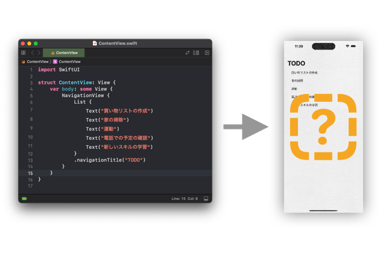
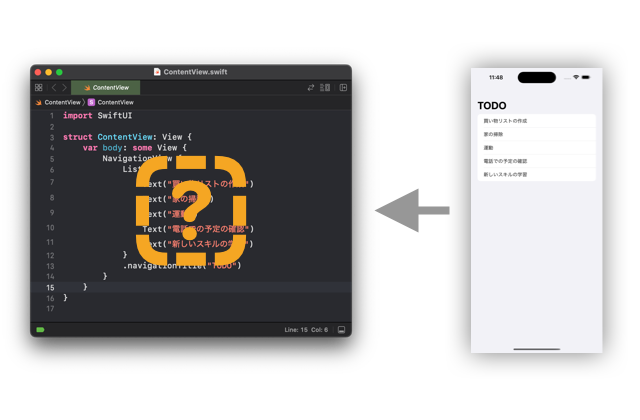
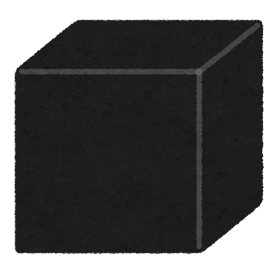
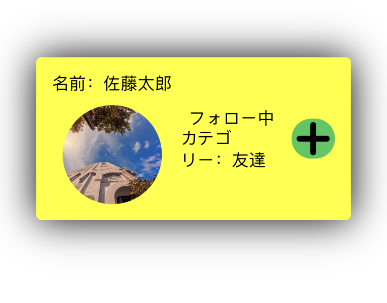

slidenumbers: true

# **UIのブラックボックスを探る**

## iOSDC23 day1 Track B noppe

^ UIのブラックボックスを探るというタイトルで発表します。よろしくお願いします。

---

## **noppe** @noppefoxwolf

- iOS app dev
- Love 🦊
- DeNA Co., Ltd.
  - Pococha
- Indie app
  - vear
  - Editormode
  - Nightfox DAWN for mastodon

^ 株式会社ディーエヌエーでiOSアプリのエンジニアをしているnoppeと言います
^ 個人開発ではVTuber向けの自撮りアプリvearや、マストドンクライアントのNightfox DAWNを作っています。
^ あと、きつねが好きです。
^ ８月頭に、第２子が生まれました。

---

# 脳内プレビュー@DeNAブース

^ そして、現在オフライン会場ではDeNAブースで脳内プレビューイベントを開催しています。このイベントは、SwiftUIのコードから、脳内で実行結果を予想し、紙にUIを描いて提出するというものです。ぜひ、遊びに来てください。

---

# 今日話すこと

^ そして先に紹介しておくと、今日は脳内プレビューと逆に既にあるUIからコードや仕様を予測するにはどうすれば良いのかということについて話します。お楽しみに

---

# Agenda

- UIのブラックボックスとは
- システムコンポーネントの分析
- まとめ

^ さて、今日は、このような流れで話します。
^ まず、タイトルにもなっているブラックボックスとは。これはこのトークのための言葉ですが、何なのか、どうしてそれを知る必要があるのかについて話します。
^ 次に、そのブラックボックスの中身を明らかにし、理解するための実践的なテクニックを色々な角度から紹介します
^ 最後に、まとめとなります。
^ だいたい20分くらいですが、途中で質問があれば、どんどん聞いてください。

---

# UIのブラックボックスとは

^ さて、まずはUIのブラックボックスとは。
^ 繰り返しになりますが、これはこのトークのための言葉なので、一般的な定義ではないことを断っておきます。

---

# UIのブラックボックスとは

^ 我々がアプリを作るときに、ほぼ必ず独自のUIコンポーネントを作ります。ここでは、カスタムUIと呼ぶことにします。
^ これは、アプリの世界観やアイデンティティを構築するために必要だったり、既存のシステムコンポーネントに不足しているコントロールを補うために必要だったりします。
^ カレンダーだったり、グラフだったり、画像ビューアだったり。

---

# UIのブラックボックスとは

^ しかし、多くのケースで、我々が作るカスタムUIは、システムコンポーネントと比べて品質が低いことが多いです。なんだかバランスが悪いとか、誰かにとって使いづらいとか、そもそも使いにくいとか。
^ どうしてこの問題が起きてしまうのか

---

# UIのブラックボックスとは

- システムのUIが全てのベース
- UIKitやSwiftUIによってその一部分は開発者に提供されている
- カスタムUIもその延長線上にあるべき
- iOSのお作法を無視してUIを作ってしまう（青い部）と、使いにくく違和感のあるものになってしまう

^ それは、システムのお作法に乗っ取っていないから。
^ ユーザーは、iOSという巨大なお作法の上に則って、アプリを使っています。
^ スクロールの慣性や、タップエリア、アクセシビリティ、アニメーション、文字の大きさ、太さなどなど。
^ これらのお作法を無視して、独自のUIコンポーネントを作ると、ユーザーは違和感を感じてしまいます。
^ 逆にお作法をトレースし、それに乗っ取ったUIを作ることができれば、ユーザーは違和感なくアプリを使うことができます。

---

# UIのブラックボックスとは

暗黙のお作法 = **ブラックボックス**

- UIの違和感の正体

^ しかし、仕様定義やUIデザインの作成の中で、こういったお作法が考慮されることほとんどありません。
^ このお作法こそ、UIにおけるブラックボックスになっているという事です。
^ 特に最近はSwiftUIを使えば、暗黙的にお作法に乗っ取ったUIを作ることができるため、独自のUIコンポーネントとの差が顕著になる傾向があります。
<!-- 時間あまりそうなら、なぜブラックボックスになってしまうのかを解説する -->
<!-- 組織で関心が持てるのがエンジニアだけだから、デザインをそのまま実装してハリボテを通してしまうから -->

---

# カスタムナビゲーションバーの例

// TODO: カスタムナビゲーションバーの画像

^ ちょっと分かりにくい話だと思うので一つ、例を挙げてみます。
^ これは、カスタムナビゲーションバーを作った例です。
^ 一見すると、システムコンポーネントと同じように見えますが、
^ 実は、シャドーの実装が違ったり、ブラーエフェクトが無かったり、端までスクロールした時の挙動が違ったり、ロングプレスジェスチャーの挙動が違ったり、などなどの違いがあります。
^ そんな小さな事、どうでも良い！と思うかもしれませんが、システムコンポーネントにあるこれらの要素がなぜあるのかを知らずに省くのは、あまりお行儀が良いとは言えません。
^ それらを必要とするユーザーだっているわけですから。

---

# お作法を知るには

- Human Interface Guideline
  - 基本的なお作法はこれ
- システムコンポーネントを分析する
  - システムコンポーネントは品質の理想値
  - HIGに書かれていないお作法を見つける

^ お作法の基本的な部分はHIGを読むのが良いでしょう。
^ 例えば、フォントサイズや、推奨されるボタンのサイズなど、基本的なお作法はHIGに書かれています。
^ それを前提に、実際にどういった値で実装されているのか、エッジケースの場合の挙動はどうなっているのかは、システムコンポーネントを分析して解明する必要があります。
^ これは、システムコンポーネントが品質の理想値だからです。

---

# システムコンポーネントの分析

- 見る
- 触る
- 聞く
- 構造を分析する

^ システムコンポーネントの分析手法は、大きく分けて4つあります。
^ それぞれ、見る、触る、聞く、構造を分析するです。
^ まずは皆さんに馴染みのある見るから見ていきます。

---

# UIを見る

- 基本中の基本
- デザインが無く、エンジニアがデザインする時に効果的
- とりあえず形から入ってみよう
- 基本はスクショや画面録画をして計測、実装して比較する
  - 一番簡単で確実

^ UIを見て観察することは、基本中の基本です。
^ ここで得られるお作法を知ることで、不恰好なUIを作らないようにすることができます。

---

## サイズ

- スクショを撮影して、測る
- 画面のスケールを割った値が、実際にCGRectで指定する値

^ まずはサイズを見ていきます。
^ これは、スクショを撮影して、測ることで、実際の値を知ることができます。
^ ただ、スケールがあるので、そのスケールを割った値が、実際にCGRectで指定する値になります。

---

## サイズの例

- ボタンサイズ
- ラインの太さ

// TODO: ボタンサイズのbefore after

^ 実用的な例では、作ろうとしている類似のコンポーネントのサイズを見て、それを参考にすることができます。
^ 

---

## 色

- スクショを撮影して、測る
- ダイナミックカラーはダークモードなどで色が変わるので注意
- 単色で無い場合も多いので注意

^ 色も見ることでも、お作法を知ることができます。

---

## 色の例

- 背景色
  - UIColor.systemBackground
- tintColor
  - ボタンの色

// TODO: スイッチと心臓ボタンの例

^ 実用的な例では、作ろうとしている類似のコンポーネントの色を見て、それを参考にすることができます。
^ 例えば、UISwitchの色と揃えることでユーザーはそれがスイッチであることを認識しやすくなります。また、ヘルスケアの色を揃えることでHealthKitと連携するボタンであることを認識しやすくなります。

---

## アニメーション

- スクリーンレコードをして、フレームを確認する
- iinaを使えば、フレーム単位でコマ送りできる

^ アニメーションはスクリーンレコードをして、フレームをコマ送りに確認することで、お作法に触れることができます。

---

## アニメーションの例

- 表示と非表示のduration
- 透過度の変わり方
- アニメーションカーブ

// TODO: Colorの角丸の例

^ アニメーションは難易度に幅があるので、まずは簡単なdurationや透過度の変わり方のお作法を身につけるのがおすすめです。

---

# 触る

^ ひとまず見ることで、UIの構造を知ることができました。
^ これだけで、だいぶiOSらしいカスタムUIが作れるようになったはずです。
^ ここからは、UIに状態や動きを与えてハリボテのUIからステップアップします。

---

## インタラクション・ジェスチャー

- タップ、スワイプ、ピンチなどのジェスチャーを実際に試す
- タップ位置を可視化するツールを使うと、実際のタップ位置や動きからズラしていることもわかる
- 不可視のジェスチャーもあるので注意
  - シェイク、マルチタップ、3Dタッチなど
- ポインターAPI

^ ほとんどのUIは操作の出来るコントロールとして存在しています。
^ そのため、実際に操作してみることで、お作法を知ることができます。

---

### インタラクション・ジェスチャー

- 先入観に捉われずに触れることが大事

^ 操作する時は、先入観に捉われずに触れることが大事です。
^ 自分にとっては知らなかったり、滅多に使わない操作でも、あるユーザーにとっては当たり前の操作かもしれません。
^ 例えば、テキストビューはシェイクすることで入力を元に戻すアラートが表示されます。
^ もしテキスト入力のUIを作る時は、同じような機能を付けることでより自然な振る舞いになります。

---

## ハードウェアキーボード・ショートカット・ポインターデバイス

- キーボードアクセサリの挙動
- ポインタがホバーした時の挙動

^ ジェスチャーと同じく、外部デバイスを接続した時の挙動についてもよく観察しておきましょう。

---

## 動的な要素

- ボタンの有効無効や、セルの表示・非表示など
  - 状態を見つけたら、再度観察をする

^ ところで、UIに触れているとUIの見た目が変化することがあります。
^ 変化は段階的に行われることもあるので、スクリーンレコードで記録しておくと良いでしょう。
^ 状態を見つけたら、再度アニメーションや色などを観察してみましょう。

---

## アクセシビリティ

- VoiceOverなどのアクセシビリティ機能を使う
- アクセシビリティ機能は、UIを変化させる

^ アクセシビリティ機能も同様に、UIを変化させることがあります。
^ 文字のサイズなどはアクセシビリティによって変化する場合でも最大サイズが設定されていたりします。
^ また、SmartInvertでは例外的に色反転を行わないようにすることができます。
^ 参考にするUIを表示した状態で一通りのアクセシビリティ機能を試してみましょう。

---

## 聞く

---

## 効果音 / haptic feedback

- タップ音、スワイプ音、アラート音など

^ iOSではあまり採用されませんが、効果音がなっているかにも注目してみましょう。
^ また、haptic feedbackもUIによっては採用されていることがあります。

---

## アクセシビリティ

https://developer.apple.com/jp/design/human-interface-guidelines/accessibility#VoiceOver

^ ボイスオーバーが読み上げる文章はHIGのアクセシビリティの項目に記載されていますが、実際にどういった内容が設定されているのかを確認しておくと良いでしょう。

---

# 構造を分析する

^ ここまでで、UIを観察して、UIの特性を理解することができました。
^ しかし、これをSwiftのコードに落とし込むには、もう少しヒントが欲しいところです。
^ 例えば、どんなビューの分け方をしているのか、ボタンのサブクラスなのか、ジェスチャーなのか、APIの設計の仕方で実装が大きく変わることもあります。
^ なるべく手戻りしたくないですから、なるべく答えに近づきたいですよね。

---

## subview探索

- subviewsプロパティを使う

^ もし、実行コードの中でUIを操作しているならsubviewsプロパティでsubviewを探索してみましょう。
^ これは、UIの構造を理解するのに役立ちます。

---

## subview探索

- lookin, Reveal, XcodeのDebug View Hierarchyなどのツールを使う
- これらのツールは、アプリのUIを解析して、UIの構造を可視化する
- これで直接答えを得ることができる

^ ビューのインスペクターアプリを使うと、さらに細かい情報を得ることができます。
^ 序盤で解説したサイズや色については、これらを使うことでほぼ直接答えを得ることができます。

---

# デモ

- lookin

---

## クラス名を知る

- subviewで手に入れたビューのクラス名を調べる
- クラス名を知ることで、ビューの目的が分かる

^ さて、UIの構造が理解出来たら、次はそのビューたちが何をしているのかを理解する必要があります。
^ クラス名を知ることで、だいたいそのビューが何をしているのかが分かります。

---

## クラス名からメソッドリストを探す

- Objective-Cの場合は、クラス名からメソッドリストを探す
- https://developer.limneos.net/

^ クラス名が分かったのなら、Githubやlimneosなどで検索するとプライベートメソッドを含んだヘッダファイルを見つけることができます。
^ これによって、API設計などを学ぶことができます。

---

## invoke method

- なんでもできる

^ インスタンスアドレスを取得することで、直接メソッドコール出来るようになります。
^ 余分なUIを消したり、状態を変えて理解を深めることができます。

---

# まとめ

カスタムUIとシステムコンポーネントの間には、大きな差があります。
システムコンポーネントを観察することで、その差を理解することができます。
観察の過程で、システムコンポーネントの意図や設計を理解することができます。
  - 解釈が一致するとは限らない
理解した上で、カスタムUIを実装するとよりiOSらしいUIを作ることができます。
  - ただしOSによって表現は異なることに注意

---

## 参考になるライブラリ

- https://github.com/scenee/FloatingPanel
- https://github.com/iDevelopper/PBPopupController
- https://github.com/omaralbeik/Drops

---

## まとめ

こんなにめんどい事をしないとカスタムUIは作れないなら、多少カスタマイズ出来なくても我慢して標準UIを素直に使いましょう。そう、SwiftUIならね。

---

## おわり
