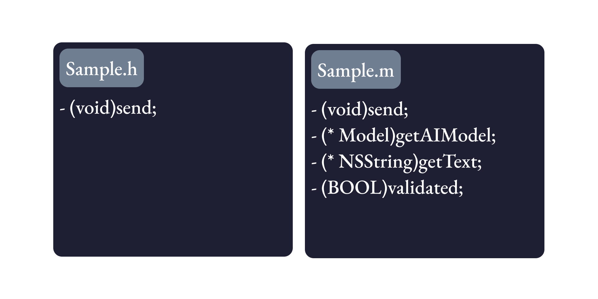

slidenumbers: true
slidecount: true
slide-transition: false
slide-dividers: #, ##, ###, ####
autoscale: true
theme: Inter 2.0, 2
background-color: #F6F5F7
header: text-scale(0.6)

# How to access hidden iOS APIs and enhance development efficacy.

2024/08/23 10:50〜
Track B
Regular talk（20 min）

# noppe

- Indie app developer
    - DAWN for mastodon
    - vear - VTuber camera app


^ こんにちは、noppeと言います。
^ 個人でmastodonのサードパーティアプリや、Vtuber向けのカメラアプリを開発しています。
^ きつねが好きで、このアイコンで活動していますのでSNSで見かけた際はぜひ話しかけてください。
^ なお、トークは日本語で行いますが、日本のエンジニアイベントに興味を持ってくれた海外の方にも楽しんでいただけるように、英語でスライドを表示しています。
^ 今日のトークでは「iOSの隠されたAPIを解明し、開発効率を向上させる方法」をお話しします。

---


^ 我々が日々アプリ開発をする際には、SwiftやObjCなどのプログラミング言語や、SwiftUIやUIKitなどのフレームワークを使ってアプリを構築しています。
^ フレームワークは特定の用途に特化していて、それらの開発を快適に進められるようにしたり、開発者が多くを学ばずともプロダクトの開発に集中できるようなAPIを提供しています。

---


^ 一方で、そういったフレームワークを構築するためのAPIは隠されており、公開されていません。
^ これらのAPIは非公開APIと呼ばれ、もちろん通常の開発では利用することができません。
^ しかし、非公開APIを使うことで、開発効率を向上させることができる場合があります。

# Agenda

- Perform
- Usecase
- Find


^ まずは、非公開APIを実行するデモンストレーションをしましょう。
^ 非公開APIには色々な種類があり、それぞれ実行する方法が異なります。
^ デモンストレーションの後に、非公開APIの最適なユースケースとリスクについて考えてみます。
^ これが、このトークのメインテーマです。
^ 最後に、非公開APIを見つける方法についてお話しします。
^ 全てのトピックに共通するのは、手段とリスクを理解することです。
^ このトークを通じて、自分なりの手段の使いどころを見つけられればと思います

## Agenda

- **Perform**
- Usecase
- Find

^ それでは、最初に非公開APIを実行する方法について理解していきましょう。
^ 非公開APIは、公開されていないAPIなので、通常の方法では呼び出すことができません。

### ObjC Private API



^ まずはObjCのAPIについて見ていきましょう。
^ ObjCでは、ヘッダーファイルと実装ファイルに定義が分かれています。
^ ヘッダーファイルにメソッドやクラスを書くことで、他のクラスにこのクラスの機能を知らせることができます。
^ つまり、ヘッダーファイルに書かれていない実装ファイルのメソッドは非公開APIということになります。

### ObjC Private API

```ObjC
Sample *object = [Sample new];

// Success
[object send]; 

// Error
[object validate]; 
```

^ 例えば、先ほどのSampleでは、sendメソッドはヘッダーファイルに書かれているので呼び出すことができます。
^ しかし、validateメソッドはヘッダーファイルに書かれていないので呼び出すことができません。
^ このような非公開APIを呼び出すためには、別の方法を使う必要があります。

### ObjC Private API

Add header file.

```ObjC
@interface Sample (Private)
- (BOOL)validate;
@end
```

```ObjC
// Success
[objcect validate];
```

^ 方法の一つは、自分でヘッダーファイルを拡張し、メソッドの宣言を追加することです。
^ これにより、実装を公開することができ、他のクラスから呼び出すことができるようになります。

### ObjC Private API

Manually dynamic dispatch

```ObjC
[object performSelector:NSSelectorFromString(@"validate")];
```

^ もう一つの方法は、Dynamic Dispatchを使うことです。
^ ObjCでは、各実装はメソッド名によって識別されるため、メソッド名を文字列で指定することで呼び出すことができます。
^ これを使うことで、非公開APIでもメソッド名がわかれば呼び出すことができます。
^ ObjCで一般的に使われているNSObjectには、performSelectorメソッドが用意されているので、これを使うことで文字列からメソッドを簡単に呼び出すことができます。

### ObjC Private API

```ObjC
object.isValidate = YES;
```

```ObjC
object.performSelector(
    NSSelectorFromString(@"setIsValidate:"), 
    withObject: @(YES)
);
```

^ プロパティの場合も、同様にperformSelectorを使って呼び出すことができます。
^ ObjCではプロパティは内部的にsetter/getterメソッドが呼び出されるため、これを使ってプロパティを操作することができます。
^ setterのように引数がある場合は、withObjectを使って引数を渡すことができます。

### Swift Hidden API

- Swift does not have header file
- Dynamic Link Framework has Swift module data

^ 次にSwiftのAPIについて見ていきましょう。
^ Swiftにはヘッダーファイルがないため、非公開APIを呼び出す方法限られます。
^ 現状では、Swiftで書かれたDynamic Link Frameworkに限って、Swiftモジュールの情報が公開されたファイルを持っており、非公開のAPIを見つけることができます。

### Swift Hidden API

- tbd
    - dynamic library stub for Eager linking [^4]
    - public and internal api list

- swiftinterface
    - public api list

[^4]: https://developer.apple.com/jp/videos/play/wwdc2022/110364/

^ モジュールの情報が公開されたファイルは、tbdファイルとswiftinterfaceファイルがあります。
^ tbdファイルには、publicとinternalのAPIリストが含まれています。
^ swiftinterfaceファイルには、publicのAPIリストが含まれています。

### Swift Hidden API

```
/Applications
    /Xcode.app
        /Contents
            /Developer
                /Platforms
                    /iPhoneSimulator.platform
                        /Developer
                            /SDKs
                                /iPhoneSimulator.sdk
                                    /System
                                        /Library
                                            /Frameworks
                                                /SwiftUI.framework
```

^ 実際にSwiftUIのフレームワークを見てみましょう。
^ SwiftUIのフレームワークは、XcodeにバンドルされているSDKの中にあります。
^ 少しパスが長いので、私はクリップボードヒストリーなどに保存して呼び出しています。

### Swift Hidden API

[.code-highlight: all]
[.code-highlight: 8, 10, 12]

```
SwiftUI.framework
├── Headers
│   ├── SwiftUI.h
│   └── SwiftUI_Metal.h
├── Modules
│   ├── SwiftUI.swiftmodule
│   │   ├── arm64-apple-ios-simulator.swiftdoc
│   │   ├── arm64-apple-ios-simulator.swiftinterface
│   │   ├── x86_64-apple-ios-simulator.swiftdoc
│   │   └── x86_64-apple-ios-simulator.swiftinterface
│   └── module.modulemap
└── SwiftUI.tbd
```

^ フレームワークは次のような構造になっています。
^ APIのリストが含まれたファイルは、このswiftinterfaceとtbdファイルです。
^ まずはswiftinterfaceファイルを見てみましょう。

### Swift Hidden API

arm64-apple-ios-simulator.swiftinterface

```swift
...
@_Concurrency.MainActor
open class UIHostingController<Content> : UIKit.UIViewController 
where Content : SwiftUICore.View {
    @_Concurrency.MainActor @preconcurrency 
    public var _disableSafeArea: Swift.Bool {
        get
        set
    }
}
...
```

^ swiftinterfaceファイルは、通常のswiftと同じように読めるテキストファイルです。
^ 実装は含まれていないので、protocolのようにメソッドの宣言だけが含まれています。
^ この例は、swiftinterfaceの一部を抜粋したものですが、UIHostingControllerに_disableSafeAreaというプロパティがあることがわかります。
^ このように、ドキュメントには載っていない隠されたAPIが実は公開されているということが分かりました。

### Swift Hidden API

```swift
let vc = UIHostingController(rootView: ContentView())
vc._disableSafeArea = true
```

^ 実際に、この_disableSafeAreaプロパティを使ってUIHostingControllerのsafeAreaを無効にすることができます。

### Swift Hidden API

SwiftUI.tbd

```
--- !tapi-tbd
tbd-version:     0
targets:         [ i386-ios-simulator, x86_64-ios-simulator, arm64-ios-simulator ]
install-name:    '/System/Library/Frameworks/SwiftUI.framework/SwiftUI'
current-version: 0.0.0
swift-abi-version: 0
exports:
  - targets:         [ i386-ios-simulator, x86_64-ios-simulator, arm64-ios-simulator ]
    symbols:         [ ... ]
```

^ 次に、tbdファイルを見てみましょう。
^ tbdファイルは、publicとinternalのAPIのリストが含まれているファイルです。
^ exportsのsymbolsには、公開されているAPIのリストが含まれています。

### Swift Hidden API

SwiftUI.tbd (exports/symbols)

```
...
'_$s7SwiftUI4ViewPAAE12userActivity...', 
'_$s7SwiftUI4ViewPAAE12userActivity...', 
'_$s7SwiftUI4ViewPAAE12userActivity...', 
'_$s7SwiftUI4ViewPAAE12userActivity...', 
'_$s7SwiftUI4ViewPAAE12variableBlur...',
'_$s7SwiftUI4ViewPAAE12variableBlur...',
...
```

^ APIのリストは、マングリングされたシンボル名が含まれています。

### Swift Hidden API

```swift
swift demangle '_$s7SwiftUI4....'

_$s7SwiftUI4.... --->
View.variableBlur(maxRadius: CGFloat, mask: Image, opaque: Bool) -> some
```

^ `swift demangle`でマングリングされたシンボル名をデマングルすると、元のメソッド名がわかります。

### Swift Hidden API

TBD

^ xxxxx

#### UnderscoredAttributes[^1] [^5]

```swift
extension View {
    @_disfavoredOverload
    func badge(_ count: Int) -> some View {
        // ...
    }
}
```

[^1]:https://github.com/swiftlang/swift/blob/main/docs/ReferenceGuides/UnderscoredAttributes.md

[^5]:https://github.com/swiftlang/swift/pull/37854

^ 最後は、SwiftのUnderscoredAttributesについて見ていきましょう。
^ Swiftには、_で始まるAttributesがいくつか存在します。
^ 例えば、@_disfavoredOverloadは同名のメソッドが呼ばれる際の優先度を下げることができます。
^ これらのAPIは特別な設定なしに使うことができます。
^ Appleのドキュメントには記載されていない隠れたAPIですが、2021年にSwiftのリポジトリにドキュメントが追加されました。
^ ドキュメントによると、UnderscoredAttributesは言語機能開発のためのものであり、通常の開発での利用は強くお勧めしないとのことです。

# Agenda

- Perform
- **Usecase**
- Find

^ これで、非公開APIがどんなもので、どのように実行するのかについて理解できました。
^ 続いて、メインテーマである開発効率を向上させるための非公開APIの最適なユースケースについて考えていきましょう。
^ その前に、一度非公開APIを使うことのリスクについて考えてみましょう。

### Hidden API's risk ⚠️

- semantics are subject to change
- side-effect is not controllable
- AppStore rejection
    - Uncompliance in review guildeline 2.5.1[^2]

[^2]:https://developer.apple.com/jp/app-store/review/guidelines/

^ 非公開APIを使うことには、いくつかのリスクが伴います。
^ まず、非公開APIはいつでも変更される可能性があります。
^ そのため、アップデートの際に挙動が変わったり、API自体が無くなる可能性があることを覚えておきましょう。
^ また、非公開APIにはドキュメントがありません。メソッドの名前から挙動を推測するしかないため、意図しない副作用が発生する可能性があります。
^ 最後に、非公開APIを使うことでAppStoreの審査基準に違反する可能性があります。
^ これらのリスクを理解した上で、非公開APIを使うことが重要です。
^ せっかくなので、リスクを下げるための方法も考えてみましょう。

### Lowering risk

- E2E testing is lowering changing and side-effect risk

```swift
func testPrivateMethod() {
    let object = Sample()
    object.performSelector(
        #Selector("setUserName:"),
        withObject: "noppe"
    )
    #expect(object.userName == "noppe")
}
```

^ メソッドの挙動が変わることや、副作用に関しては、定期的に実行するテストの中でE2Eテストを書くことでリスクを低減することができます。

### Lowing risk

- Use beta version for early detection

^ OSやフレームワークのベータ版でテストを行うことで、早期に変更を検知することもできます。

## What's the best usecase?

|Development Phase|Suitable|
|---|---|
|Concept Development| :+1: |
|Testing| :warning: |
|Product Development| :bomb: |

^ それでは、これらのリスクを理解した上で、隠されたAPIをどのような場面で使うのが最適なのか考えてみましょう。
^ 開発は、コンセプト開発、テスト、製品開発の3つのフェーズに分けることができます。
^ コンセプト開発では、アイデアを形にするために短いサイクルで開発を進めるため、隠されたAPIを使うことで開発効率を向上させることができます。
^ テストでの利用は、APIが変更されたときの影響が大きいですが便利なテストを書くことができます。
^ 製品開発フェーズでは、隠されたAPIを使うことは避けるべきです。しかし、隠されたAPIからデザインを学ぶことはできます。
^ それでは、それぞれのフェーズでの隠されたAPIの使いどころを掘りさげていきましょう。

### Concept Development

- Concept Development, Hackathon, UI Design
    - Troublesome implementation
    - Difficult implementation
    - Complex visual effect

^ コンセプト開発やハッカソン、UIデザインなどの場面は、隠されたAPIの使い所です。
^ 時間のかかる実装や、先ほどのVariableBlurのように複雑なビジュアルエフェクトを隠されたAPIを使うことで短時間で実装することができます。

#### UITextView.setAttributedPlaceholder:[^8]

```swift
extension UITextView {
    func setPlaceholder(_ placeholder: String?) {
        let string = placeholder.map(NSAttributedString.init)
        let selector = Selector(("setAttributedPlaceholder:"))
        if responds(to: selector) {
            perform(selector, with: string)
        }
    }
}
```

[^8]:https://gist.github.com/AdamWhitcroft/c6ffc0323b9ce227588df7145685ae26#file-wrappeduitextview-swift-L41

---


#### UINavigationItem._setWeeTitle:[^7]

```swift
extension UINavigationItem {
    func setWeeTitle(_ title: String) {
        let selector = Selector(("_setWeeTitle:"))
        if responds(to: selector) {
            perform(selector, with: title as NSString)
        }
    }
}
```

[^7]:https://github.com/feedback-assistant/reports/issues/506

#### UINavigationItem._setWeeTitle:


#### UIReturnKeyType(rawValue: 126)

```swift
textField.returnKeyType = UIReturnKeyType(rawValue: 126)!
```

#### UIReturnKeyType(rawValue: 126)


#### _UIHostingView

```swift
let view = _UIHostingView(rootView: ContentView())
```

^ SwiftUIのViewを使って、UIHostingViewを使うことで、SwiftUIのViewをUIKitのViewとして使うことができます。

### Testing 

UIDebuggingInformationOverlay

- iOS10+
- iOS11+ needs some changes


^ アプリのテストフェースでは、UIDebuggingInformationOverlayを使って、UIのデバッグを行うことができます。
^ この機能はiOS10に導入された非公開APIで、アプリのUIをデバッグする際に役立ちます。

#### Instruments


^ 知識として非公開APIを知っておくと、Instrumentやスタックトレースを使ってデバッグする際に役立ちます。

### Product Development

Using hidden API is risky.

But, You can learn design from hidden API.

^ 製品開発フェーズでは、隠されたAPIを使うことは避けるべきです。
^ しかし、隠されたAPIからAPIのデザインを学ぶことはできます。

#### API naming

Can find official SDK naming rule from header

```ObjC
-(void)_endScrollingCursorOverrideIfNecessary;
-(UIOffset)_firstPageOffset;
-(id)_frameLayoutGuideIfExists;
```

^ 例えば、APIのメソッド名を決める時どんな単語を使うべきかを学ぶことができます。

#### API design

Can learn UI scructure, architecture

```ObjC
@interface UITextView : UIScrollView {
    _UITextContainerView* _containerView;
    ...
}
...
@end
```

^ 同様に、APIの設計やクラスの分け方なども学ぶことができます。

## How to find hidden APIs?

- Read swiftinterface, tbd, headers
- Get Method name list
- Read Stacktrace
- Find SNS Posts
- Send feedback to Apple

^ 最後に、非公開APIを見つける方法についてお話しします。
^ ここまでの話で、swiftinterfaceやtbdを読むことで非公開APIを見つけることができることがわかりました。
^ ここでは、いくつかの隠れたAPIを見つけるテクニックを紹介します。

### Get Method name list

```swift
let selector = Selector("_methodDescription")
let names = scrollView.perform(selector)
print(names)
```

^ ObjCで書かれたフレームワークの場合、インスタンスに_methodDescriptionを使うことで、クラスが持つ全てのメソッド名を取得することができます。

### Read Stacktrace


^ 特定の動作に関連するメソッド名を見つけるために、スタックトレースを読むこともオススメです。
^ 特にUIスレッドのスタックトレースを読むことで、UIの挙動に関連するメソッド名を見つけることができます。
^ 例えば、UIRefreshControlの挙動を調べる際に、アクションがトリガーされるところまでのスタックトレースを読むとスクロール周りの内部ハンドラを一気に見つけることができます。

### Find SNS Posts

- Survey in SNS, gist and more.


^ SNSでは非公開APIに関する情報が共有されていることがあります。
^ 例えば、TwitterやGitHub Gistなどで非公開APIに関する情報を共有している人がいるかもしれません。
^ こういった情報を見つけることで、非公開APIを見つける手がかりを得ることができます。

### Send feedback to Apple

- Send feedback to Apple

^ 最後に、非公開APIを見つけた際には、Appleにフィードバックを送ることも重要です。
^ どんなユースケースがあるのか、どのようなAPIが欲しいのかをAppleに伝えることで、APIが公開される可能性があります。

# Recap

- Perform
- Usecase
- Find

^ これで、非公開APIを実行する方法、最適なユースケース、非公開APIを見つける方法について理解できました。
^ 非公開APIは、開発効率を向上させるための手段の一つです。
^ しかし、リスクを理解した上で使うことが重要です。
^ また、非公開APIを使うことで、フレームワークの裏側に興味を持つことができ、開発効率を向上させることができます。
^ このトークを通じて、非公開APIを使うことのメリットとデメリットを理解していただければと思います。

# Next steps

- Thinking about backend everytime

^ 最後に、隠されたAPIで開発効率を向上するために普段からフレームワークの裏側に興味を持つことが重要です。
^ 隠れているものを探したり、制御するためには多くの時間がかかります。
^ 必要な瞬間に、すぐに使えるようにしておくことが重要です。

# Thank you for listening!


^ 以上になります。ありがとうございました。

--- 

# References

https://www.jacklandrin.com/2018/05/16/method-in-objective-c-messgae-passing/

https://xta0.me/2023/06/28/Swift-modules-1.html

